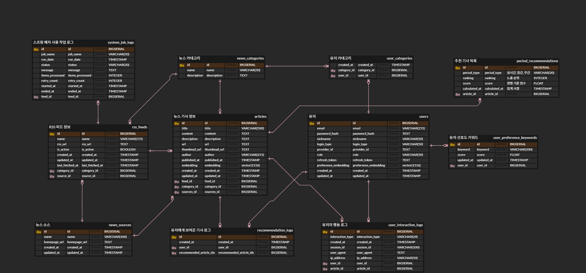
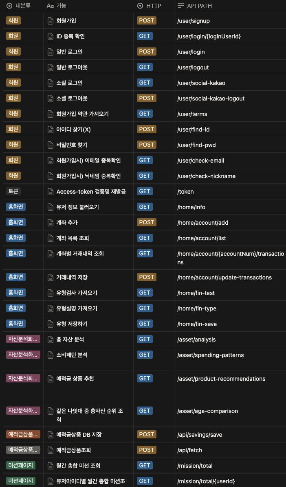

# Newstagram Backend

# 📋 프로젝트 개요

### 1-1. 프로젝트 소개

---

Newstagram은 사용자의 활동 로그를 분석하여 RSS 뉴스 피드를 선별 제공하고, 개인화된 기사를 추천하는 지능형 뉴스 서비스이다.

### 1-2. 주요 목적

---

- 여러 언론사의 뉴스를 한곳에서 손쉽게 통합 조회
- 최신 핵심 현안(실시간, 주간)을 빠르게 파악
- 사용자의 구독 성향을 분석한 맞춤형 콘텐츠 제공
- 사용자가 직접 정의하는 고유의 주제별 뉴스 분류 기능 제공

## 2. 주요 기능

### 2-1. 핫 이슈 뉴스 피드

---

여러 언론사에서 쏟아지는 기사 중 **현재 가장 많이 다뤄지고 있는 이슈의 기사**를 한눈에 확인할 수 있다.

**카테고리(정치·경제·사회·스포츠 등)별**로 어떤 이슈가 뜨겁게 다뤄지고 있는지 보여주며, **실시간 · 일간 · 주간** 단위로 트렌드를 선택해서 확인할 수 있다.

### 2-2. 개인 맞춤 뉴스 피드

---

사용자는 별도의 설정 없이 **자신의 읽기 패턴에 기반한 개인 맞춤 뉴스**를 자동으로 받아볼 수 있다.

내가 어떤 기사를 자주 읽는지, 어떤 분야에 관심이 많은지를 **AI가 분석**해 나에게 알맞은 뉴스를 추천한다.

### 2-3. 문장으로 만드는 나만의 뉴스 피드

---

사용자는 원하는 뉴스의 스타일이나 주제를 **문장으로 자연스럽게 입력**하여 나에게 맞는 뉴스를 추천받을 수 있다.

예) “요즘 KBO에서 기아 타이거즈 관련한 소식이 궁금해.”

→ 해당 의도에 맞는 최신 스포츠·야구·기아팀 관련 기사 추천

예) “최근 인공지능 산업 동향 알려줘.”

→ 기술·산업·AI 관련 트렌드 기사 제공

## 3. 기능 요구사항

| 요구사항명                          | 요구사항 상세                                                   | 우선순 |
| ----------------------------------- | --------------------------------------------------------------- | ------ |
| 기사 수집                           | 일정 시간을 주기로 RSS를 통해 언론사별 기사를 수집              | 상     |
| 유사 내용 기사 그룹핑               | 유사한 내용의 기사들은 하나의 이슈로 그룹핑                     | 상     |
| 각 이슈 그룹의 대표 기사 선정       | 화면에 표시할 대표 기사 선정                                    | 중     |
| 카테고리별 기사 분류                | 카테고리별로 기사 필터링                                        | 중     |
| 실시간/일간/주간 이슈 기사 구분     | 기사 작성일을 기준으로 관리                                     | 중     |
| 사용자 기사 클릭 로그 저장          | 사용자가 기사를 클릭할 때마다 로그로 저장                       | 상     |
| 사용자 관심사와 유사한 기사 추천    | 클릭한 기사 기반으로 사용자의 관심사를 분석 후 유사한 기사 추천 | 상     |
| 사용자 입력 문장과 유사한 기사 추천 | 사용자가 입력한 자연어 문장과 유사한 기사 추천                  | 중     |
| 회원관리                            | 회원가입, 수정, 조회, 탈퇴                                      | 상     |
| 로그인 관리                         | 로그인, 로그아웃, 비밀번호 찾기                                 | 상     |
| 프로필 정보 수정                    | 기사 조회 기록 삭제                                             | 하     |

## 4. 기대효과

- **정보 탐색 시간의 획기적 단축**
  - 분산된 언론사 사이트를 일일이 방문하는 대신, 한곳에서 실시간으로 통합된 뉴스를 확인함으로써 정보 수집에 드는 시간과 노력을 최소화한다.
- **사용자 편의성 및 정보 접근성 극대화**
  - 명확하고 간결한 인터페이스(UI) 설계를 통해, 사용자가 원하는 정보에 즉각적으로 도달할 수 있는 편리한 이용 환경을 제공한다.
- **최신 트렌드 및 이슈 신속 파악**
  - 시의성 높은 실시간/주간 인기 기사를 전면에 배치하여, 사용자가 사회의 주요 동향과 핵심 이슈를 놓치지 않도록 돕는다.
- **사용자 주도형 정보 큐레이션**
  - 자연어 프롬프트 기능을 활용해 자신만의 관심 주제를 설정함으로써, 수동적으로 정보를 소비하던 방식에서 벗어나 능동적으로 정보를 관리할 수 있게 된다.
- **언론사별 시각 비교 분석 용이**
  - 동일한 사건을 다루는 여러 언론사의 보도를 한 화면에서 비교할 수 있어, 사안에 대한 다각적이고 균형 잡힌 시각을 갖추는 데 도움이 된다.

---

## 5. 화면 설계

### 5-1. 로그인 화면


**주요 기능**

- 아이디/비밀번호 입력을 통한 일반 로그인
- 카카오 OAuth2 소셜 로그인
- Google OAuth2 소셜 로그인
- 회원가입 링크 제공
- 비밀번호 찾기 기능

**기술 구현**

- JWT 기반 토큰 인증
- Spring Security OAuth2 Client 통합
- Redis 세션 관리

---

### 5-2. 회원가입 화면


**주요 기능**

- 사용자명(username) 입력 및 중복 확인
- 비밀번호 입력 및 확인 (최소 8자, 영문+숫자+특수문자)
- 이메일 입력 및 인증
- 선호 카테고리 선택 (정치, 경제, 사회, 스포츠 등)
- 약관 동의 체크박스

**유효성 검증**

- 실시간 입력 값 검증 (프론트엔드)
- 서버 사이드 검증 (백엔드)
- 중복 체크 API 호출

---

### 5-3. 메인 화면 (뉴스 피드)


**주요 영역**

#### 1) 상단 네비게이션

- 로고 및 서비스명
- 검색바 (자연어 입력 지원)
- 사용자 프로필 메뉴

#### 2) 핫 이슈 뉴스 섹션

- 실시간/일간/주간 탭 선택
- 이슈별 그룹핑된 기사 카드
  - 대표 썸네일 이미지 (S3 저장)
  - 기사 제목 및 요약
  - 언론사 로고
  - 이슈 그룹 내 기사 개수 표시
  - 인기도 점수 (클러스터링 기반)
- 카드 클릭 시 해당 이슈의 모든 기사 목록 모달 표시

#### 3) 개인 맞춤 뉴스 섹션

- 사용자 읽기 패턴 기반 추천 기사
- 관심사 태그 표시
- "더보기" 버튼으로 추가 로드 (무한 스크롤)

#### 4) 프롬프트 검색 섹션

- 자연어 입력창 ("요즘 KBO에서 기아 타이거즈 관련한 소식이 궁금해")
- AI 분석 결과 기반 추천 기사 리스트
- 유사도 점수 표시

---

### 5-4. 개인 카테고리 추가


**주요 기능**

**프롬프트 검색 섹션**

- 자연어 입력창 ("요즘 KBO에서 기아 타이거즈 관련한 소식이 궁금해")
- AI 분석 결과 기반 추천 기사 리스트
- 유사도 점수 표시

**화면 구성**

- 텍스트 프롬프트
- 저장 버튼

---

# ✨ 개발 컨벤션 및 Git 커밋 컨벤션

## 📝 공통 자바 개발 컨벤션

### 1. 명명 규칙

- **변수/함수**: 카멜케이스(camelCase) 사용
  - 예시: `userName`, `getUserInfo()`
- **클래스/인터페이스**: 파스칼케이스(PascalCase) 사용
  - 예시: `UserService`, `LoginRequest`

### 2. 주석 규칙

- 함수의 목적, 동작, 변경사항을 명확하게 설명
- JavaDoc 스타일 권장
  - 예시:1
  ```java
  /**
   * 사용자 정보를 반환합니다.
  * @param userId 사용자 ID (파라미터 정보)
  * @return 사용자 정보 (리턴 값 정보)
  */
  public User getUserInfo(Long userId) { ... }
  ```

---

## 🐙 Git 커밋 컨벤션

- 커밋 메시지는 아래와 같은 형식으로 작성합니다:
  ```
  [타입] - 변경사항 요약
  ```
  - 예시: `[feat] - 사용자 로그인 기능 추가`
- subject(요약)는 **50자 이내**로 간결하게 작성 (명령형 어조)
- 주요 타입 예시:
  - feat: 새로운 기능 추가
  - fix: 버그 수정
  - docs: 문서 수정 (README, 주석 등)
  - style: 코드 스타일 변경 (포맷, 세미콜론 등)
  - refactor: 코드 리팩토링(기능 변경 없이 코드 구조 개선)
  - test: 테스트 코드 추가/수정
  - chore: 기타 변경사항 (코드 동작 영향 없음, 버전 빌드 관리)

---


# 데이터베이스 설계 
## ERD 설계도


# API  
## Swagger 사용


